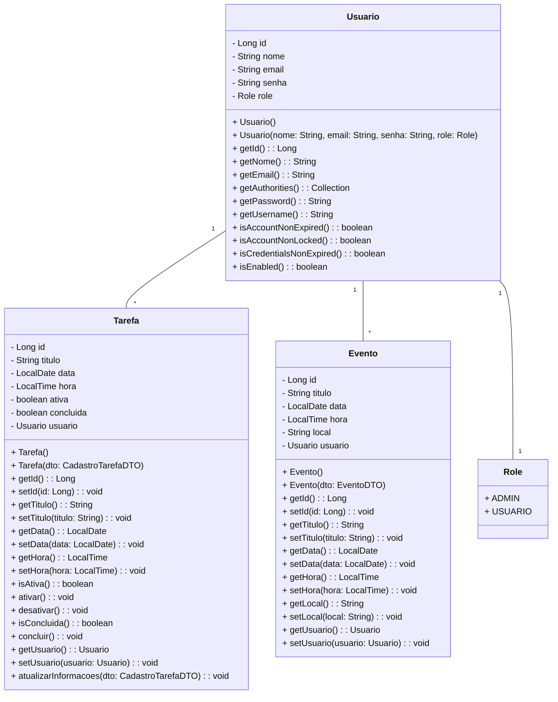
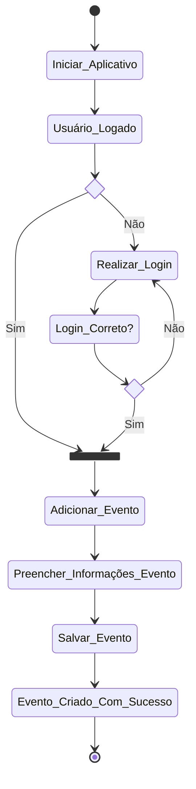
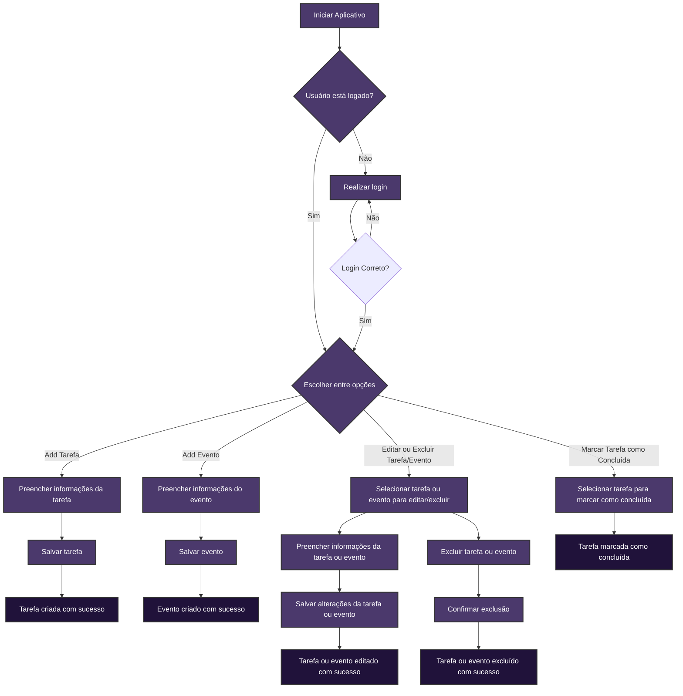

# Lifesync

## Escopo do Sistema
O *LifeSync* é um sistema de agenda que tem como objetivo fornecer aos usuários uma ferramenta eficiente para organizar a vida em todos os seus aspectos, gerenciando seus compromissos e tarefas diárias. 
As principais funcionalidades incluem a capacidade de gerenciar eventos e tarefas na agenda - podendo criá-los, editá-los, excluí-los  e visualizá-los. Tudo isso será feito quando o usuário criar uma conta e efetuar login. Além disso, o sistema oferece diversas outras  funcionalidades: notificações sobre eventos iminentes, categorização de eventos por tipo para organização, pesquisa avançada por título, data ou categoria, compartilhamento de eventos com outras pessoas via e-mail, mensagem ou redes sociais, importação de eventos de outras fontes como Google ou Outlook, e a opção de compartilhar um quadro de horários para marcar compromissos. Com todos esses recursos, o LifeSync espera que os usuários tenham uma boa experiência e tenham suas necessidades de organização atendidas., sendo abrangente e flexível.

## Equipe
- Ana Luísa Araújo Bastos: Backend Developer
- Iasmin Correa Araújo: Full Stack Developer
- Matheus Felipe Akira de Assis Oliveira: Backend Developer
- Thais Ferreira da Silva: Frontend Developer

## Tecnologias Utilizadas
- Linguagem: Java (Backend), JavaScript (Frontend)
- Frameworks: React.js (Frontend), Spring Boot (Backend)
- Banco de Dados: MySQL

## Histórias de Usuários (Backlog do Produto)

1. Como usuário, gostaria de poder adicionar um novo evento à minha agenda, fornecendo detalhes como título, data, hora e local, editar essas informações e deletar o evento.
2. Como usuário, gostaria de poder adicionar uma nova tarefa à minha agenda, fornecendo detalhes como título, data e prazo, e marcar como concluída ou deletá-la.
3. Como usuário, gostaria de visualizar os compromissos da minha agenda.
4. Como usuário, gostaria de criar uma conta e fazer login
5. Como usuário, gostaria de poder receber notificações e lembretes sobre eventos iminentes da minha agenda e tarefas com prazo chegando ao fim.
6. Como usuário, gostaria de poder categorizar meus eventos por tipo (trabalho, pessoal, lazer, etc.) para uma melhor organização.
7. Como usuário, gostaria de poder pesquisar eventos específicos na minha agenda por título, data ou categoria.
8. Como usuário, gostaria de poder compartilhar eventos da minha agenda com outras pessoas, seja por e-mail, mensagem ou redes sociais.
9. Como usuário, gostaria de poder importar eventos de outras fontes, como calendários do Google ou Outlook, para integrá-los à minha agenda pessoal.
10. Como usuário, gostaria de conseguir compartilhar um quadro de horários para que as pessoas possam marcar compromissos comigo
11. Como usuário, gostaria de criar eventos e tarefas utilizando comandos de voz para evitar o trabalho de criá-los manualmente.

## Backlog do Sprint:

### 1. Adicionar, editar e deletar eventos na agenda:
- Tarefa 1: Instalar e configurar banco de dados [Todos]
- Tarefa 2: Instalar Java, Node.js e npm [Todos]
- Tarefa 3: Criar a classe de entidade Evento e mapeá-la para o banco [Iasmin, Matheus]
- Tarefa 4: Configurar a conexão da aplicação com o banco [Iasmin]
- Tarefa 5: Criar versão inicial da tela principal [Thaís]
- Tarefa 6: Criar formulário para adicionar novo evento com campos para título, data, hora e local.[Thaís]
- Tarefa 7: Implementar lógica de criar novo evento no backend[Matheus]
- Tarefa 8: Desenvolver página de visualização de detalhes do evento. [Thaís]
- Tarefa 9: Implementar lógica de obter dados do evento no backend. [Matheus]
- Tarefa 10: Desenvolver página de edição de evento com campos preenchidos com informações existentes do evento. [Thaís]
- Tarefa 11: Implementar lógica de atualizar evento no banco de dados após edição. [Matheus]
- Tarefa 12: Criar botão de edição do evento [Thaís]
- Tarefa 13: Criar botão de exclusão do evento [Thaís]
- Tarefa 14: Implementar funcionalidade para remover evento do banco de dados. [Matheus]
- Tarefa 15: Remover o evento da tela quando excluído [Thaís]

### 2. Adicionar e marcar tarefas como concluídas na agenda:
- Tarefa 1: Criar a classe de entidade Tarefa e mapeá-la para o banco [Iasmin, Ana Luísa]
- Tarefa 2: Criar formulário para adicionar nova tarefa com campos para título e data [Thaís]
- Tarefa 3: Implementar lógica de criar nova tarefa no backend [Ana Luísa]
- Tarefa 4: Desenvolver página de visualização de detalhes da tarefa. [Thaís]
- Tarefa 5: Implementar lógica de obter dados da tarefa no backend. [Ana Luísa]
- Tarefa 6: Desenvolver página de edição de tarefa com campos preenchidos com informações existentes do evento.[Thaís]
- Tarefa 7: Implementar a lógica de atualizar tarefa no banco de dados após edição. [Ana Luísa]
- Tarefa 8: Implementar funcionalidade de marcar tarefa como concluída [Ana Luísa]
- Tarefa 9: Implementar funcionalidade de exclusão de tarefa [Ana Luísa]
- Tarefa 10: Criar botão de conclusão de tarefa [Thaís]
- Tarefa 11: Criar botão de exclusão de tarefa [Thaís]
- Tarefa 12: Remover a tarefa da tela quando concluída ou excluída [Thaís]

### 3. Visualizar os compromissos da agenda:
- Tarefa 1: Criar página de visualização geral da agenda [Thaís, Iasmin]
- Tarefa 2: Implementar no backend a lógica de obter eventos e tarefas do banco de dados para exibição [Matheus]
- Tarefa 3: Implementar ordenação de eventos e tarefas por data e hora [Iasmin]

### 4. Criar conta e fazer login:
- Tarefa 1: Implementar página de registro de conta [Thaís]
- Tarefa 2: Criar tabela no banco de dados para armazenar informações de conta [Iasmin]
- Tarefa 3: Implementar página de login [Thaís]
- Tarefa 4: Desenvolver funcionalidade de autenticação para login [Iasmin]

## Versão Revisada do Backlog do Sprint: 

### 1. Adicionar, editar e deletar eventos na agenda:
- [x] Tarefa 1: Instalar e configurar banco de dados [Todos]
- [x] Tarefa 2: Instalar Java, Node.js e npm [Todos]
- [x] Tarefa 3: Criar a classe de entidade Evento e mapeá-la para o banco [Iasmin, Matheus]
- [x] Tarefa 4: Configurar a conexão da aplicação com o banco [Iasmin]
- [x] Tarefa 5: Criar versão inicial da tela principal [Thaís]
- [x] Tarefa 6: Criar formulário para adicionar novo evento com campos para título, data, hora e local.[Thaís]
- [x] Tarefa 7: Implementar lógica de criar novo evento no backend[Matheus]
- [x] Tarefa 8: Desenvolver página de visualização de detalhes do evento. [Thaís]
- [x] Tarefa 9: Implementar lógica de obter dados do evento no backend. [Matheus]
- [x] Tarefa 10: Desenvolver página de edição de evento com campos preenchidos com informações existentes do evento. [Thaís]
- [x] Tarefa 11: Implementar lógica de atualizar evento no banco de dados após edição. [Matheus]
- [x] Tarefa 12: Criar botão de edição do evento [Thaís]
- [x] Tarefa 13: Criar botão de exclusão do evento [Thaís]
- [x] Tarefa 14: Implementar funcionalidade para remover evento do banco de dados. [Matheus]
- [x] Tarefa 15: Remover o evento da tela quando excluído [Thaís]

### 2. Adicionar, editar, excluir e marcar tarefas como concluídas na agenda:
- [x] Tarefa 1: Criar a classe de entidade Tarefa e mapeá-la para o banco [Iasmin, Ana Luísa]
- [x] Tarefa 2: Criar formulário para adicionar nova tarefa com campos para título e data [Thaís]
- [x] Tarefa 3: Implementar lógica de criar nova tarefa no backend [Ana Luísa]
- [x] Tarefa 4: Desenvolver página de visualização de detalhes da tarefa. [Thaís]
- [x] Tarefa 5: Implementar lógica de obter dados da tarefa no backend. [Ana Luísa]
- [x] Tarefa 6: Desenvolver página de edição de tarefa com campos preenchidos com informações existentes do evento.[Thaís]
- [x] Tarefa 7: Implementar a lógica de atualizar tarefa no banco de dados após edição. [Ana Luísa]
- [x] Tarefa 8: Implementar funcionalidade de marcar tarefa como concluída [Ana Luísa]
- [x] Tarefa 9: Implementar funcionalidade de exclusão de tarefa [Ana Luísa]
- [x] Tarefa 10: Criar botão de conclusão de tarefa [Thaís]
- [x] Tarefa 11: Criar botão de exclusão de tarefa [Thaís]
- [x] **Tarefa 12: Remover a tarefa da tela quando concluída ou excluída [Thaís]**  
	**-> Tarefa 12: Remover a tarefa da tela quando excluída [Thaís]**  
	**-> Tarefa 13: Riscar a tarefa na tela quando concluída[Thaís]**

### 3. Visualizar os compromissos da agenda:
- [x] Tarefa 1: Criar página de visualização geral da agenda [Thaís, Iasmin]
- [x] Tarefa 2: Implementar no backend a lógica de obter eventos e tarefas do banco de dados para exibição **[Iasmin]**
- [x] Tarefa 3: Implementar ordenação de eventos e tarefas por data e hora [Iasmin]

### 4. Criar conta e fazer login:
- [x] Tarefa 1: Implementar página de registro de conta [Thaís]
- [x] Tarefa 2: Criar tabela no banco de dados para armazenar informações de conta [Iasmin]
- [x] Tarefa 3: Implementar página de login [Thaís]
- [x] Tarefa 4: Desenvolver funcionalidade de autenticação para login [Iasmin]

#### *Extra*
### 5. Criar eventos e tarefas utilizando comando de voz: 
- [x] **Tarefa 1: Criar botão de comando de voz [Thaís]**
- [x] **Tarefa 2: Implementar no backend a lógica de comando de voz [Matheus]**

## Diagramas UML
### Diagrama de Classes

### Diagrama de Atividades

## Fluxograma

